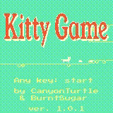

Play official game here: <https://wasm4.org/play/kittygame>

Play latest development release here: <https://canyonturtle.github.io/kittygame>

Find and play older versions here: <https://github.com/CanyonTurtle/kittygame/releases>

# Kitty Game

A game written in Rust for the [WASM-4](https://wasm4.org) fantasy console.

## Building

Build the cart by running:

```shell
cargo build --release
```

Then run it with:

```shell
w4 run target/wasm32-unknown-unknown/release/cart.wasm
```

For more info about setting up WASM-4, see the [quickstart guide](https://wasm4.org/docs/getting-started/setup?code-lang=rust#quickstart).

## Assets

`src/kitty_ss.rs` and `src/title_ss.rs` aren't hand-written -- they're generated
from `kitty-ss.png` (192x64) and `kitty_title.png` (152x50) by WASM-4's
`png2src` tool:

```shell
npx -p wasm4 w4 png2src --rust kitty-ss.png --output kitty_ss.rs
npx -p wasm4 w4 png2src --rust kitty_title.png --output title_ss.rs
```

This has been verified to reproduce the exact byte arrays currently committed
in both files. After generating, two manual steps are still needed before the
output matches what's checked in:

1. Add `pub` to the generated `const` declarations (`png2src` emits private
   `const`s).
2. Run `cargo fmt` on the file to get the wrapped, multi-line array
   formatting used elsewhere in the repo.

Gotchas if you regenerate:

- `title_ss.rs`'s constant prefix, `OUTPUT_ONLINEPNGTOOLS`, comes from
  whatever the source file was named at the time it was first generated
  (`output_onlinepngtools.png` -- a typical export name from an online PNG
  editor), not from `kitty_title.png`'s current name. `png2src` derives
  constant names from the input filename, so regenerating from a
  differently-named file produces different constant names and breaks the
  `use title_ss::{OUTPUT_ONLINEPNGTOOLS_WIDTH, ...}` imports in `lib.rs`.
  Rename your source file to `output_onlinepngtools.png` before running the
  command above, or update those imports afterward.
- `kitty_ss.rs` doesn't carry the `KITTY_SS_WIDTH`/`_HEIGHT`/`_FLAGS`
  constants `png2src` normally emits alongside the byte array -- they were
  stripped after generation. The commented-out lines in `src/spritesheet.rs`
  (`// const KITTY_SS_WIDTH: u32 = 192;` etc.) are what they looked like;
  the game actually uses the differently-named `KITTY_SPRITESHEET_*`
  constants defined right below those comments instead.

## Links

- [Documentation](https://wasm4.org/docs): Learn more about WASM-4.
- [Snake Tutorial](https://wasm4.org/docs/tutorials/snake/goal): Learn how to build a complete game
  with a step-by-step tutorial.
- [GitHub](https://github.com/aduros/wasm4): Submit an issue or PR. Contributions are welcome!
